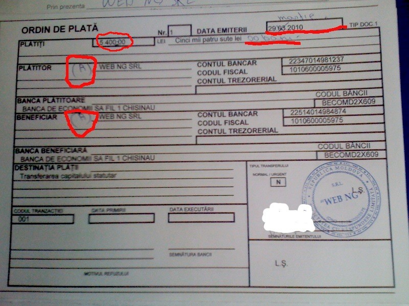

= Contabil în Moldova

În acest document voi descrie experiența mea de contabil la firma proprie.

== Blancuri de la editura statistică
Pentru a obține blancuri în activitatea firmei, trebuie de dat comandă la Editura Statistică, București 34, bir 4.
Prima dată se prezintă administratorul cu următoarele documente:

* Certificatul de înregistrare, fără acest document vă vor întoarce înapoi.
* Copia certificatului de înregistrare
* Copia extrasului din registrul de stat
* Cererea pentru a comanda documentele necesare
* Ștampila

Cererea se scrie simplu:
Către Editura statistică
XYZ SRL solicită eliberarea formularelor cu regim special:

1. ...
1. ...
1. ...
1. ...

Conducătorul, semnătura, numele, ștampila.

Pentru link:http://www.webng.md/[compania mea] care se activează în domeniul IT am comandat
următoarele documente pe care am achitat în martie 2010 148 lei:

* M-2a Delegație, cod 4060, 50 buc
* Facturi de expediție în trei exemplare, cod 4098, formă specială
pentru programe electronice.
* Act servicii, cod 4108, 100 buc.
* Registrul de reclamații, cod 4147, o carte
* Condica de înregistrarea a controalelor, cod 3649, o bucată.
* CO-1 Dispoziție de încasare, cod 3014
* CO-2 Dispoziție de plată, cod 3015
* Registru regim special, cod 4058, 48 buc

E necesar să luați o pungă că sunt multe sau contra la 1 leu
procurați de pe loc de la ei.

== Prima dispoziție de plată

Ea trebuie ca să transferi capitalul statutar de pe contul provizoriu pe cel current.
Destinația plății: Transferarea capitalului statutar

Greblele pe care am călcat:

* Data trebuie să fie în format: 29 martie 2010
* La suma de transfer trebuie folosită liniuța în loc de punct/virgulă, de exemplu: 5400-00
* Suma cu litere trebuie să încludă și bănuții pe 2 cifre: Cinci mii patru sute lei și 00 bani.
* Plătitorul și beneficiarul trebuie să aibă (R) în față, dacă e rezident.
* Trebuie să semnați de două ori dispoziția de plată dacă sunteți și contabil-șef și conducător.

