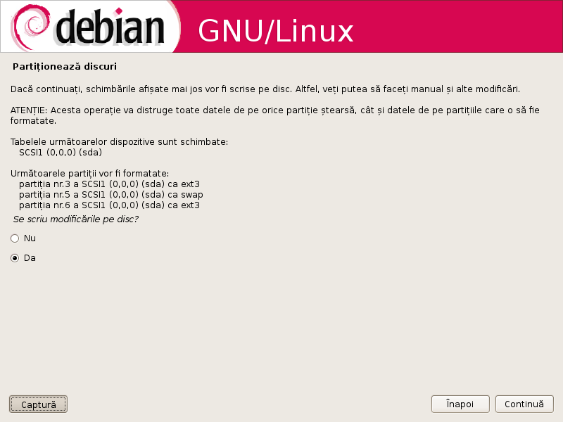
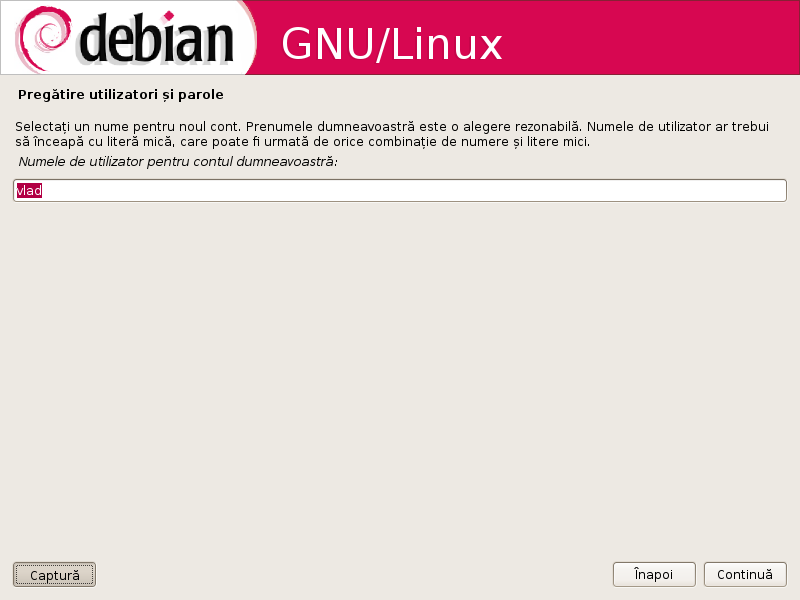

= Instalarea Debian pas cu pas

Acest ghid vă arată cum să instalați sistemul de operare Debian.
Întroducem CD or DVD în dispozitiv și ne bootăm de pe CD.

image:images/install/mirror_http_hostname_0.png[Selectăm oglinda de
pachete pe care o vom folosi-o]

image:images/install/finish-install_reboot_in_progress_0.png[Restartarea
calculatorului]

Ne restartăm și savurăm proaspăta instalare Debian.

Adresați întrebări pe http://forum.linux.md, dacă aveți careva probleme
cu pașii de mai sus. Baftă!
