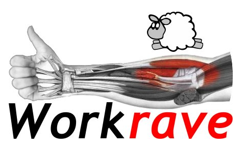
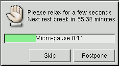
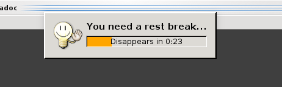
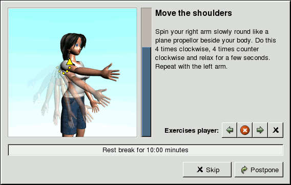
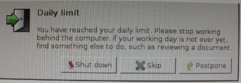
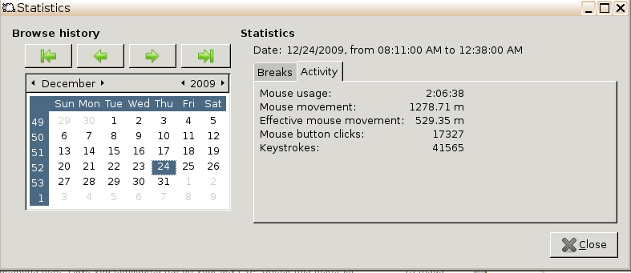
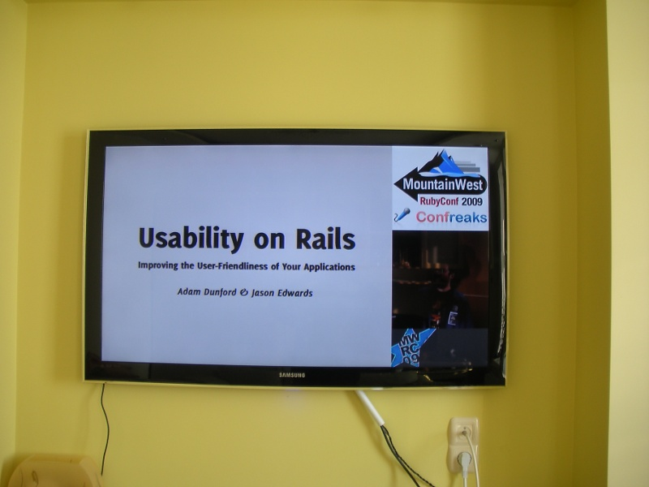

= Workrave - ajutorul Nr.1 p-u cei ce lucrează la computer

== Introducere

Eu lucrezi de 3 ani la domiciliu și mă simt foarte minunat. De ce e
mai bine să lucrezi acasa? Nu pierzi timp pe transport să te duci și
să vii de la lucru. Cel puțin 2 ore pe zi le pierzi pe drum, dar pe
timp de iarnă 4 ore garantat. Cum îmi reușește? Foarte simplu. Am avut
noroc să găsesc un serviciu la o companie din US și lucrezi prin
internet. Apare o problemă cu lucrul la computer pe care toți o știu:
se lucrează de pe scaun și aceasta nu este de loc bine pentru
sănătatea noastră. (TODO: link de la Seth Godin: health receipt)

Căutând pe web careva programe care să mă ridice de
pe scaun la intervale de timp, am dat peste link:http://www.workrave.org[workrave].

Dacă lucrezi 2 ore în continuu te simți mai obosit decât când lucrezi
cu workrave și pauzele mici și mari. E verificată pe mine.

În plus se potrivește de minune cu GTD(Getting things done, vezi
link:http://blog.rubyonrails.md/articles/2009/01/17/gtd-modelul-natural-de-planificare/[modelul natural de planificare])

== Instalarea
Instalarea în Debian este cât se poate de simplă:
----
sudo apt-get install workrave
----

Utilizatorii Windows, pot link:http://www.workrave.org/download/[descărca programa de instalare] de pe site-ul oficial.

== Configurarea
Mie nu mi-am plăcut opțiunile implicite, așa că le-am modificat puțin.

* Ziua de lucru la computer am mărit-o de la 4 la 8 ore, în zilele noastre nu
sunt monitoare de celea vechi care strică ochii, LCD-urile și
LED-urile sunt foarte calitative.
* Pauza mică - o minută la fiece 10 minute.
* Pauza mare - 10 minute la fiecare oră. Puteți pune la 45 minute, ca ora academică.

== Screenshots
Pauza mică

Pauza mare, înștiinșare

Pauza mare, exerciții

Stop!, ajunge pe azi ;-) Mi-a blocat tastatura și nu puteam face print
screen, așa că a trebuit să fac o poză.

Vedeți pe site-ul oficial mai multe link:http://www.workrave.org/screenshots/unix/[screen-uri cu workrave].

== Statistică

Workrave mai strînge și statistică de utilizare a tastaturii și mouse-ului, mai jos e un screenshot cum arată o zi de lucru la mine:

== Integrarea cu GTD

Eu deobicei când vreau să fiu cât mai productiv deconectez orice ce
poate să mă întrerupă, schimbarea taskurilor e
costisitoare, oamenii nu-s mașini și ca să te concentrezi din nou la
problemă, îți ia o bucată de timp. Deconectez mobilul, telefonul fix, IM, Skype, Kmail(mail
client), alte programe care arată notificări, vă sfătui să faceți
acest experiment.

Ce se poate de făcut în timpul când workrave ne trimite să facem o
pauză? Uitați-vă cu ce mă ocup eu spre exemplu:

* Pauza de 1 min: privesc pe fereastră să-mi relaxez vederea, workrave
are un exercițiu pentru ochi, î-l practic. Mai fac niște exerciții fizice, yoga sau
cîteva ”magical passes” de la Carlos Castaneda. Mănânc un măr, o portocală.
* Pauza de 10 minute: beau un ceai sau o cafea, rad mustețile ;-), fac
un duș, dau cu aspiratorul. Fac apeluri telefonice din contextul Calls de la GTD. Mă joc
cu copiii sau discut ceva cu soția. Oricum facem toate aceastea, de ce să nu le combinăm?!
* După 8 ore de lucru, mă așez în fața TV-ului și privesc conferințe
video de pe youtube sau materiale video descărcate pe usb-hdd.

Se mai poate de descărcat de pe torrentsmd.com niște materiale didactice
video și de urmărit. În timp ce privesc la TV, am alături de mine un
creion și o foaie pentru a face notițe, dacă imi vine vreo idee în cap,
ca mâine dimineață se le adaug în GTD și s-o i-au de la capăt.

== PS
Mulțumesc că ați citit acest articol, sper să vă fie de folos aceste practici și aveți grijă de sănătatea
dvs.
